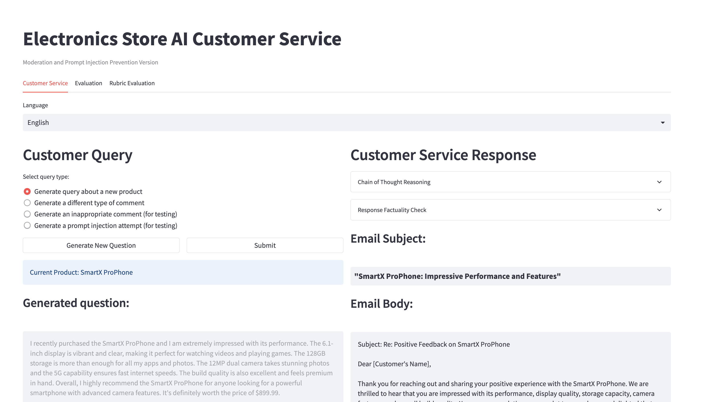

# Electronics Store AI Customer Service

[](https://opensource.org/licenses/MIT)

An AI-powered customer service system for an electronics store, showcasing modern web development practices and AI integration.



## 🗂️ Related Resources
- Vanilla Version: https://github.com/Absorber97/electronics-store-ai-customer-service
- Presentation (Google Slides): https://docs.google.com/presentation/d/1Na3DeV5GxMFI_pGsbzRqY5_n50C9S7q58NMmF0wn4is/edit?usp=sharing 
- Presentation (PDF): https://drive.google.com/file/d/1LZKzggcWEOOO5ja2245MZhmHGHpQ0kO0/view?usp=sharing 

## 🚀 Features

- AI-generated customer queries and responses using OpenAI's GPT-3.5 Turbo
- Multi-language support (English, Spanish, French, German, Italian)
- Sentiment analysis of customer comments
- Email subject and body generation for professional customer communication
- Responsive web interface built with Streamlit
- Content moderation to filter inappropriate or offensive content
- Prompt injection detection and prevention for enhanced security
- Query classification into primary and secondary categories
- Chain-of-thought reasoning for more detailed and accurate responses
- Factuality checking of AI-generated responses against product information
- Random product and comment type generation for diverse scenarios
- Simulated product database with detailed descriptions
- Interactive UI elements for generating and submitting customer queries
- Real-time display of AI processing steps and results
- Expandable sections for viewing detailed AI reasoning and evaluations
- Color-coded success/warning messages for moderation and injection detection results
- Customizable generation types (e.g., new product queries, different comment types)
- Error handling and logging for both frontend and backend
- Scalable architecture with separation of concerns (backend services, frontend components)

## 🛠️ Tech Stack

- **Backend**: Node.js, Express.js
- **Frontend**: Python, Streamlit
- **AI**: OpenAI GPT-3.5 Turbo
- **Database**: JSON files (simulating a database)
- **API**: RESTful architecture
- **Development**: npm, pip, nodemon

## 🏗️ Architecture

1. **Backend (Node.js)**:
   - Handles API requests
   - Communicates with OpenAI API
   - Processes data and generates responses
   - Modular design with separate routes, controllers, and services

2. **Frontend (Streamlit)**:
   - Interactive web interface
   - Communicates with backend API
   - Displays generated questions and responses

3. **AI Integration**:
   - Utilizes OpenAI's GPT-3.5 Turbo for natural language processing
   - Generates human-like responses to customer queries

## 📋 Prerequisites

- Node.js (v14 or later)
- Python (v3.7 or later)
- OpenAI API key

## 🚀 Getting Started

1. Clone the repository:
   ```
   git clone https://github.com/Absorber97/electronics-store-ai-customer-service.git
   cd electronics-store-ai-customer-service
   ```

2. Install dependencies:
   ```
   npm install
   pip install -r requirements.txt
   ```

3. Set up your OpenAI API key:
   - Rename `.env.example` to `.env`
   - Add your OpenAI API key to the `.env` file:
     ```
     OPENAI_API_KEY=your_api_key_here
     ```

4. Run the application:
   ```
   npm run app
   ```

## 💡 Usage

1. Select your preferred language from the dropdown menu.
2. Generate a new customer query using the provided options.
3. Submit the query to generate a customer service response.
4. View the response, including email subject and body.

## 📁 Project Structure

```
electronics-store-ai-customer-service/
├── backend/
│   ├── config/
│   ├── controllers/
│   ├── middleware/
│   ├── routes/
│   ├── services/
│   └── app.js
├── frontend/
│   └── streamlit_app.py
├── data/
│   ├── categories.json
│   ├── detailed_descriptions.json
│   └── products.json
├── .env.example
├── .gitignore
├── LICENSE
├── README.md
├── package.json
├── requirements.txt
└── run_app.sh
```

## 🔍 Key Implementation Details

1. **RESTful API**: The backend implements a RESTful API using Express.js, following best practices for route organization and controller separation.

2. **Middleware**: Custom error handling middleware is implemented to manage and respond to errors consistently across the application.

3. **Environment Variables**: Sensitive information like API keys is managed using environment variables for enhanced security.

4. **Modular Architecture**: The backend is organized into separate modules (routes, controllers, services) for improved maintainability and scalability.

5. **Asynchronous Programming**: Async/await is used for handling asynchronous operations, improving code readability and error handling.

6. **Cross-Origin Resource Sharing (CORS)**: CORS is implemented to allow the frontend to communicate with the backend securely.

7. **Natural Language Processing**: The application leverages OpenAI's GPT model for advanced natural language understanding and generation.

8. **Multi-language Support**: The system can handle queries and generate responses in multiple languages, showcasing its versatility.

9. **Interactive Frontend**: Streamlit is used to create an interactive and responsive web interface without the need for complex frontend development.

10. **Data Persistence**: JSON files are used to simulate a database, demonstrating data handling and persistence concepts.

## ⚡️ Future Enhancements

- Implement user authentication and authorization
- Integrate a proper database system (e.g., MongoDB, PostgreSQL)
- Add unit and integration tests for improved reliability
- Implement caching mechanisms for improved performance
- Dockerize the application for easier deployment and scaling

## 🤝 Contributing

Contributions are welcome! Please feel free to submit a Pull Request.

## 🪪 License

This project is licensed under the MIT License - see the [LICENSE](LICENSE) file for details.
